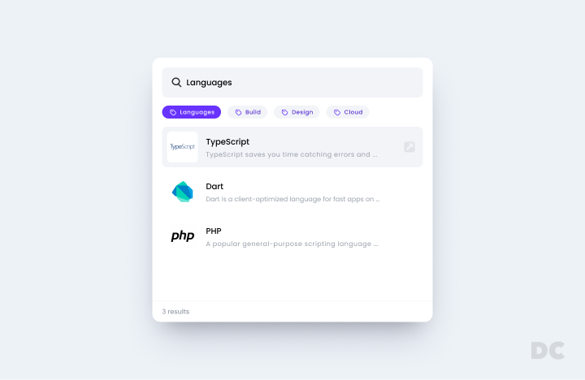

# 前端测试题 - 开发一个搜索应用

其他语言版本：[English](./README.md)

我们想让你来开发一个搜索应用来搜索我们平时在 DC 做开发时大多都会用到哪些技术，让我们现在开始吧！

## 物料

- 全部的设计稿都在这里: [打开 Figma 在线预览](https://www.figma.com/file/mcHQ3hMUG0fmgWVh6QPUlv/Frontend-test-What-technologies-we-are-using-at-DC?node-id=71%3A377)，在开发时你应该严格按照上面的尺寸与布局来排版。对了，在打开链接后你应该还需要创建一个自己的账号来获取设计上的精确样式以及尺寸以便帮助你开发。
- 搜索数据应该从这个 API 中获取 [`GET -> https://frontend-test-api.digitalcreative.cn/?query=flutter`](https://frontend-test-api.digitalcreative.cn/?search=flutter)
- 应用应该具备 4 种基本形态
    - 用户没有搜索到结果：此时 API 返回了为空的数组数据

      

    - 用户搜索到了结果：此时 API 返回了有结果的数组数据 

      
    
    - 搜索正在进行中：此时 API 正在响应过程中

      

    - 搜索时遇到错误：此时服务器返回错误或者请求超时

      

## 基本规则

- 整个应用应该用 Vue 技术栈做开发，因为他是我们目前 Web 前端的主要技术栈

- 尽可能的创造可重复利用的通用组件

- 你最起码应该创建三个组件

  - 搜索框组件

    

  - 标签

    

  - 搜索结果单个条目组件

    

- 你可以用你想用 CSS 预处理器，即使在 DC 我们用 Sass，但是你用其他的也可以。

- 你需要在你提交的代码包里增加一个 `README.md` 介绍，这个介绍里大概应该包含一些你做某些决策的原因，你想额外的我们表达或者分享的信息（比如哪个地方其实可以继续做优化），以及说明你所选用的脚手架的安装、运行方式以便让我们运行起来并给你的作品打分。

- 当你完成了所有任务后请将项目放进 zip 压缩文件内发送给我

## 我们青睐哪种作品

- 清晰的项目结构与逻辑。因为你要知道，相比于写代码来说，读代码可能是更高频的场景。
- 干净利落的 UI 结构、数据流设计以及状态管理。
- 代码洁癖，语法现代。

## 加分项

- 使用 Vue 3
- 使用 Typescript
- 严格以像素为单位进行 UI 实现
- 用现代的脚手架工具进行构建
- 增加过渡动画
- 增加键盘控制
- 根据你的想法做额外的功能与界面优化
- ...

## 最终效果

- 正常使用

  

- 错误处理

  

- 超时处理

  

- 键盘控制处理（如果有最好）

  

---

如果你有任何疑问欢迎随时联系我们 (hello@digitalcreative.asia).

我们已经迫不及待的想要看到你的成果了！