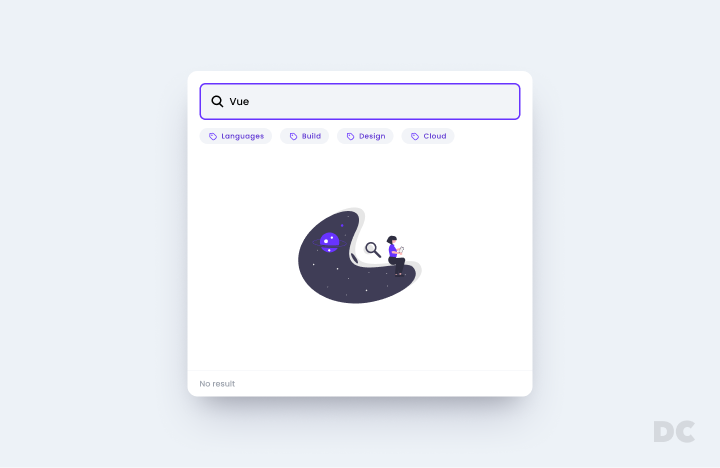
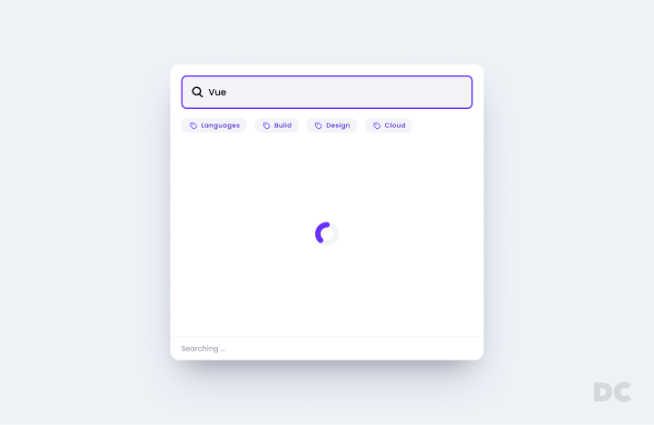
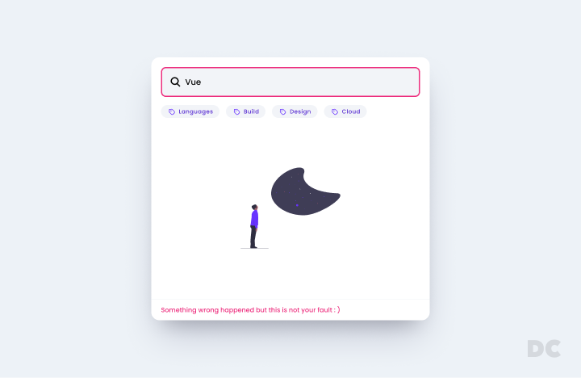
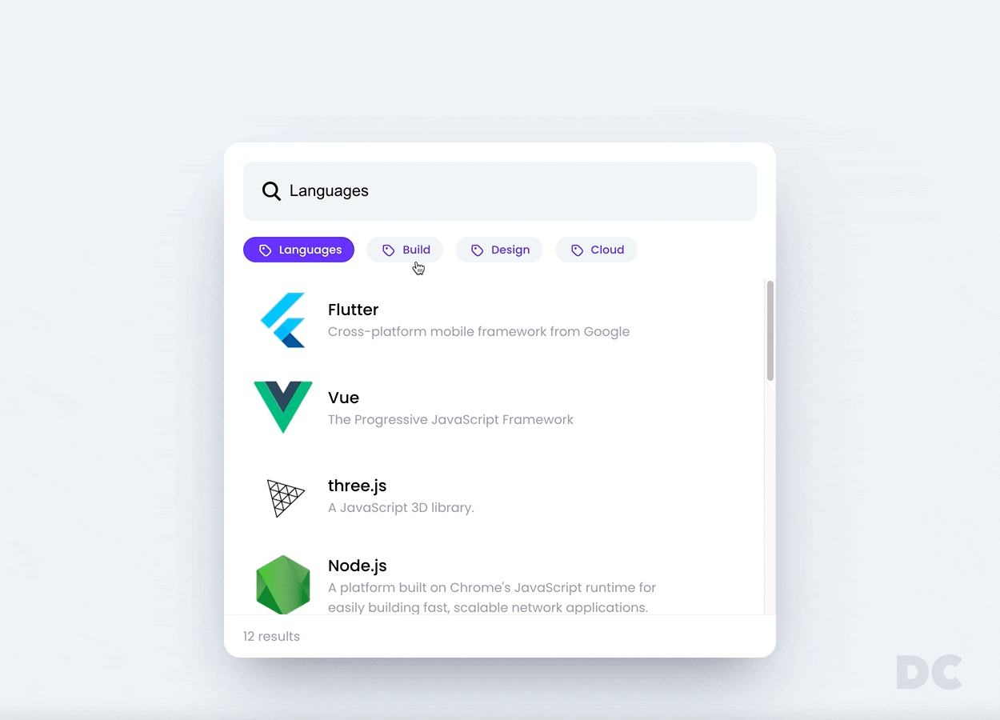
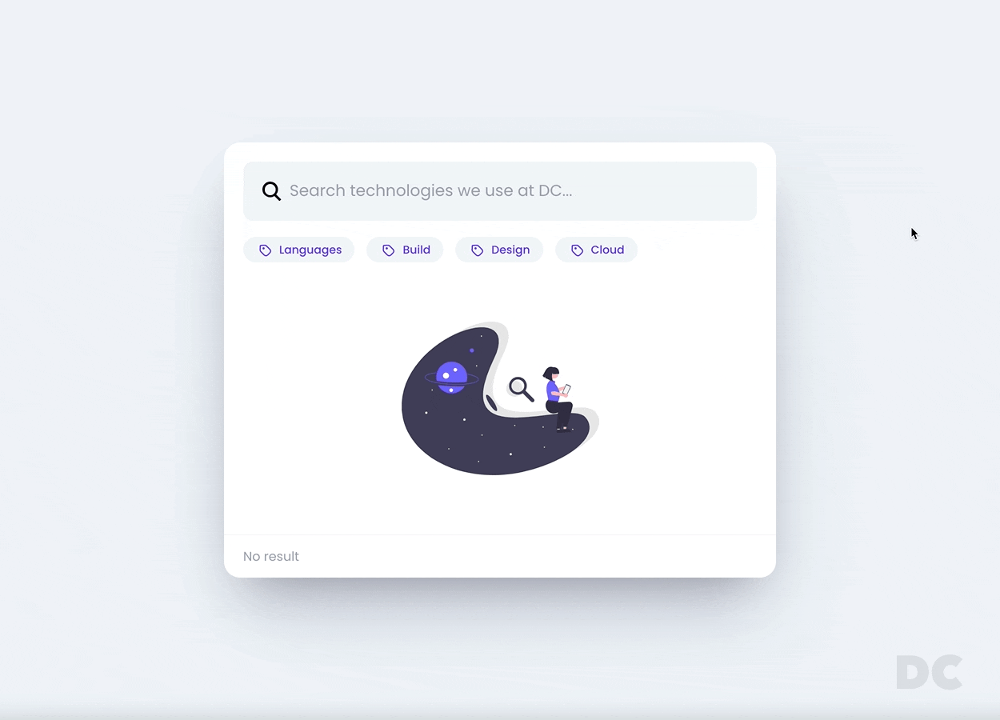

# Front-end Test - Building a Search Box Component

Versions in other languages: [中文](./README-ZH.md)

We want you to develop a search box component that has the function of searching for the programming tools we are using at DC. Let's get started!

## Materials

- The completed pages should strictly follow the design templates offered by us, which can be found here: [design templates on Figma](https://www.figma.com/file/mcHQ3hMUG0fmgWVh6QPUlv/Frontend-test-What-technologies-we-are-using-at-DC?node-id=71%3A377). *You may need to create a free account to be able to inspect the elements precisely*.

- The data should be retrieved from the following API: [`GET -> https://frontend-test-api.digitalcreative.cn/?no-throttling=true&search=flutter`](https://frontend-test-api.digitalcreative.cn/?no-throttling=true&search=flutter)

- A total of 4 different searching states of the search box should be included:

    - Successful request without any result: When the API responses, no result was found.

      

    - Successful request with results: When the API responses, the results are successfully found.

      
    
    - Pending request: When the request hasn't yet gotten a response.

      

    - Error while requesting: When the API is responding, an error or a timeout occurred.
     
        *Please note that you have to change the `no-throttling` parameter in the query string to `false` to make the API simulate this kind of situation.*

      

## Rules

- The application has to be developed using Vue or React.

- Split your code into logical reusable components. We want to see how you isolate your components.

- You have to create at least 3 universal components, which are

  - Search bar component

    

  - Tag component

    

  - Result item component

    
  
- For styling, you can go for anything of your choice. We use Tailwind CSS and Sass at DC, but you can feel free to use any CSS frameworks or preprocessors that you're more comfortable with.

- Write a `README.md` file that documents your thinking process when working on this task - you can also add any additional information that you'd like to share with us, such as suggestions or questions. Last, don't forget to include an installation instruction for us.

- When you get all those things done please send us a zip file that includes the project.

## What we will be looking for

- A nice architecture. Code should be written in a way that's easy to read and follow - a clear folder structure is very crucial as well.
- A good UI composition. We'll evaluate your work based on how you connected the components, how the data flows, how the states are managed within the application.
- Consistent and clean code.

## Bonus points

- Used Typescript
- Implemented pixel-perfect UI
- Adopted up-to-date building frameworks/tools
- Incorporated CSS animations/transitions
- Added keyboard controls (Tab key)
- Improved functions or UI/UX according to your own thoughts
- ...

## Final effects

- Normal usage

  

- Dealing with error

  

- Dealing with timing out

  

- Dealing with keyboard controls (nice to have)

  

---

If you have any doubt, don't hesitate and send us an email (hello@digitalcreative.asia).

We can't wait to see what you come up with! Thanks for your time!
